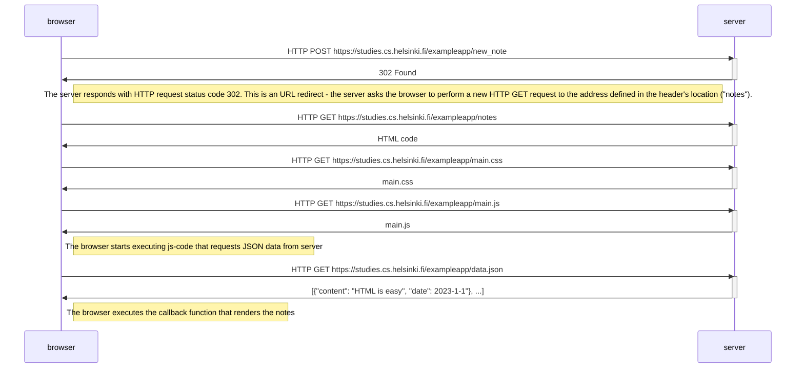

```mermaid
sequenceDiagram
participant browser
participant server

browser->>server: HTTP POST https://studies.cs.helsinki.fi/exampleapp/new_note
activate server
server->>browser: 302 Found
deactivate server

Note right of browser: The server responds with HTTP request status code 302. This is an URL redirect - the server asks the browser to perform a new HTTP GET request to the address defined in the header's location ("notes").

browser->>server: HTTP GET https://studies.cs.helsinki.fi/exampleapp/notes
activate server
server->>browser: HTML code
deactivate server

browser->>server: HTTP GET https://studies.cs.helsinki.fi/exampleapp/main.css
activate server
server->>browser: main.css
deactivate server

browser->>server: HTTP GET https://studies.cs.helsinki.fi/exampleapp/main.js
activate server
server->>browser: main.js
deactivate server

Note right of browser: The browser starts executing js-code that requests JSON data from server

browser->>server: HTTP GET https://studies.cs.helsinki.fi/exampleapp/data.json
activate server
server->>browser: [{"content": "HTML is easy", "date": 2023-1-1"}, ...]
deactivate server

Note right of browser: The browser executes the callback function that renders the notes
```
